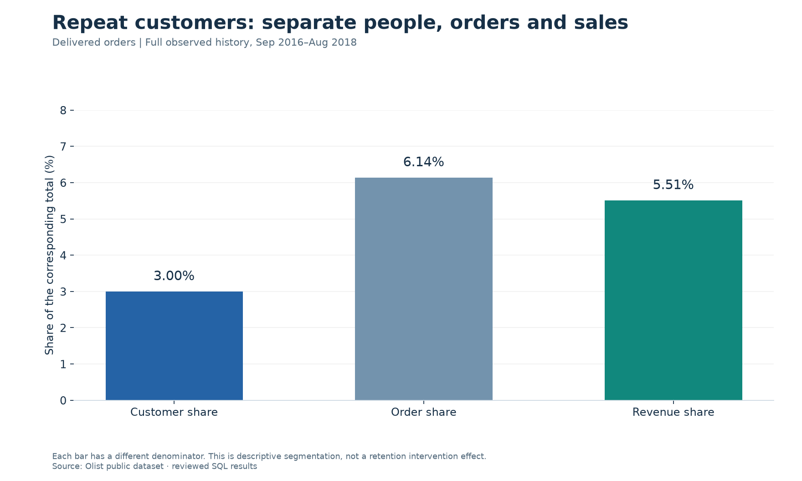
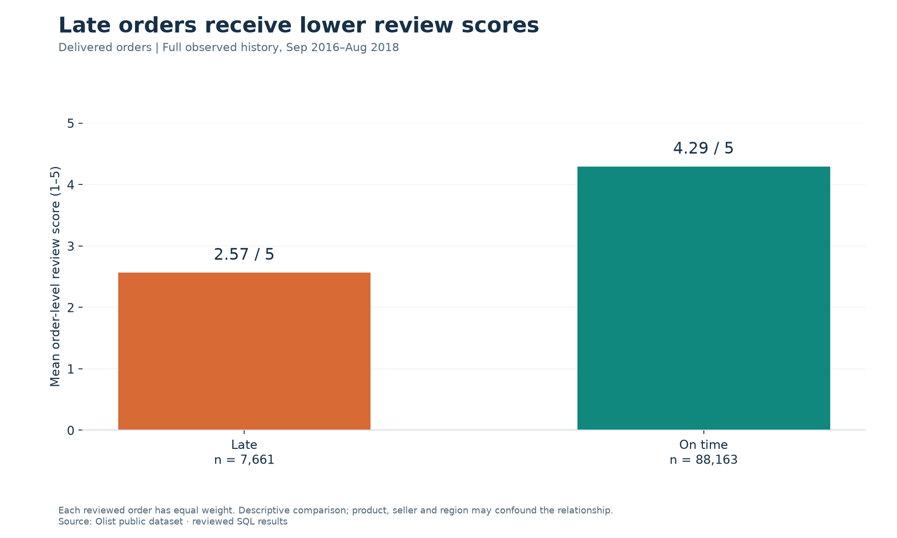

# Olist e-commerce SQL analysis

**Three business questions, answered with SQL: where sales come from, who returns, and how delivery relates to customer reviews.**

[Q1: Sales](reports/Q1-sales.md) · [Q2: Customers](reports/Q2-customers.md) · [Q3: Delivery](reports/Q3-delivery.md) · [Methodology](docs/methodology.md)

This portfolio project analyses the Brazilian e-commerce dataset published by Olist. It starts with a relational model and data-quality checks, then uses joins, CTEs and window functions to investigate sales concentration, repeat purchasing and delivery performance.

This is a **PostgreSQL / pgAdmin SQL project**. The workflow covers relational modelling, CSV import, data-quality checks and business analysis using joins, CTEs, aggregates and window functions. The primary reproduction path runs entirely in PostgreSQL; Python is not required. [Optional chart automation](docs/optional-automation.md) is provided separately.

## At a glance

| Measure | Result | Scope |
| --- | ---: | --- |
| Source orders | 99,441 | All order statuses |
| Delivered orders | 96,478 | Sales and customer analysis |
| Purchasing customers | 93,358 | Unique people with a delivered order |
| Merchandise sales | R$13,221,498.11 | Item prices; excludes freight |
| Delivery-eligible orders | 96,470 | Delivered, with actual and estimated delivery dates |

The source contains purchases from September 2016 to October 2018. Delivered purchases end in August 2018. The monthly sales charts focus on January 2017–August 2018; other headline results use the full observed delivered-order history. These are historical observations, not current Olist performance.

## What the analysis found

| Question | Evidence | Business implication to investigate |
| --- | --- | --- |
| **Q1. Where are sales concentrated?** | São Paulo accounts for **38.33%** of merchandise sales; SP, RJ and MG together account for **63.38%**. | Prioritise operational capacity in the largest markets and investigate growth elsewhere. |
| **Q2. How much do repeat customers contribute?** | Repeat customers are **3.00%** of customers, **6.14%** of orders and **5.51%** of sales. The highest-spending fifth contributes **56.62%** of sales. | Test retention initiatives using consistent follow-up windows and a control group. |
| **Q3. How does delivery relate to reviews?** | **8.11%** of eligible deliveries are late by timestamp. Late orders average **2.57/5**, versus **4.29/5** for on-time orders. | Investigate delay-prone routes and test customer communication improvements. |

These implications are proposals for further work. The dataset does not measure the effect of an intervention, profit or customer lifetime value.





## Explore the research

- [Q1 — Sales performance](reports/Q1-sales.md): monthly volume, revenue growth, state concentration and product categories.
- [Q2 — Customer behaviour](reports/Q2-customers.md): one-time versus repeat customers, spending quintiles and first repurchase intervals.
- [Q3 — Delivery and satisfaction](reports/Q3-delivery.md): delivery speed, late-delivery rates, geographic differences and review scores.
- [Validation report](docs/validation.md): quality checks, metric corrections, reconciliations and limitations.
- [Original research archive](archive/README.md): all five original SQL files, 15 original charts and the ERD, preserved for provenance.

## Reproduce with PostgreSQL / pgAdmin

Use **PostgreSQL 18** with pgAdmin or the `psql` client. The schema, import scripts and all analytical queries have been tested on PostgreSQL 18.6 against the full dataset.

1. Download or clone this repository and obtain the nine CSVs listed in [data/README.md](data/README.md).
2. Create a new, empty database named `olist_portfolio` and run [the schema SQL](sql/setup/01_schema.sql).
3. Import the CSVs using pgAdmin's Import/Export Data dialog, or the supplied [psql import script](sql/setup/02_import.psql).
4. Run [data-quality checks](sql/setup/03_quality.sql), followed by the [analytical model](sql/00_model.sql) and Q1/Q2/Q3 SQL.
5. Inspect the result sets with [04_results.sql](sql/04_results.sql), or export the tables to CSV.

The [step-by-step PostgreSQL guide](docs/postgresql-setup.md) includes the import order, pgAdmin settings and SQL execution sequence.

For `psql`, place the CSVs in `data/raw/` and run these commands **from the repository root**. Replace `postgres` with your PostgreSQL login if different; the client prompts for a password when required.

```bash
createdb -h localhost -U postgres olist_portfolio
psql -X -h localhost -U postgres -d olist_portfolio -v ON_ERROR_STOP=1 -f sql/setup/01_schema.sql
psql -X -h localhost -U postgres -d olist_portfolio -v ON_ERROR_STOP=1 -f sql/setup/02_import.psql
psql -X -h localhost -U postgres -d olist_portfolio -v ON_ERROR_STOP=1 -f sql/run_analysis.psql
```

Optional SQL-only CSV export:

```bash
psql -X -h localhost -U postgres -d olist_portfolio -v ON_ERROR_STOP=1 -f sql/export_results.psql
```

The SQL path returns all 10 analytical result tables. The committed research pages and figures can be viewed immediately; regenerating the presentation images is a separate [optional workflow](docs/optional-automation.md).

## SQL skills demonstrated

- Relational schema design, primary/composite keys and foreign-key constraints.
- Data-quality checks for missing fields, duplicate records, join coverage and timestamp consistency.
- CTEs and grain-aware joins to prevent duplicated order counts and sales.
- `LAG`, `ROW_NUMBER` and `NTILE` for monthly growth, first repurchases and customer segmentation.
- Conditional aggregation and window totals for clearly defined rates and shares.

## Repository guide

```text
sql/setup/            PostgreSQL schema, CSV import and data-quality checks
sql/                  Analytical model, Q1/Q2/Q3 queries, result display and export
reports/              Research pages, figures and aggregate results
docs/                 PostgreSQL setup, metric definitions and validation
data/                 Dataset instructions; raw CSVs stay local
archive/              Original PostgreSQL SQL, charts and ERD
tests/                PostgreSQL regression SQL and optional helper tests
scripts/              Optional chart automation and repository checks
.github/workflows/    PostgreSQL checks and optional helper checks
```

Raw CSVs, database files, environments and credentials are excluded from Git. The source files in `archive/` preserve the original exploratory work; the reviewed scripts in `sql/` are the runnable edition.

## Analytical decisions

- Revenue means **merchandise item value in BRL**, excluding freight. It is not Olist's platform revenue, profit or net revenue after refunds.
- Customers are identified with `customer_unique_id`; `customer_id` is the order-level customer record.
- Items are aggregated before joining to orders. Multiple reviews are averaged within each order, so an order receives equal weight in the score comparison.
- Timestamp-based lateness is kept for comparability. A calendar-date definition produces **6.77%** rather than **8.11%**; [Q3](reports/Q3-delivery.md) explains why.
- Repeat purchasing is observed within a finite extract. The 3.00% share is not a cohort retention rate, and first-repeat intervals include same-day purchases.

See [methodology](docs/methodology.md) for populations, denominators, exclusions and temporal caveats.

## Source and attribution

Data: [Brazilian E-Commerce Public Dataset by Olist](https://www.kaggle.com/datasets/olistbr/brazilian-ecommerce), published by Olist on Kaggle. The publisher describes it as anonymised commercial data. The raw dataset is not redistributed here; consult the source page for its terms.

Original SQL analysis and figures: [autunno816-ux](https://github.com/autunno816-ux). Repository packaging, reproducibility scripts and validation refinements were prepared with AI assistance. This is an independent portfolio project, not an official Olist report.
