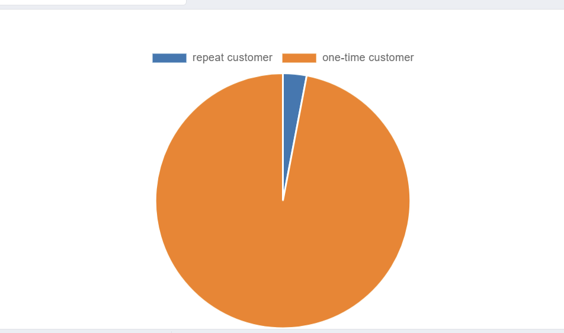
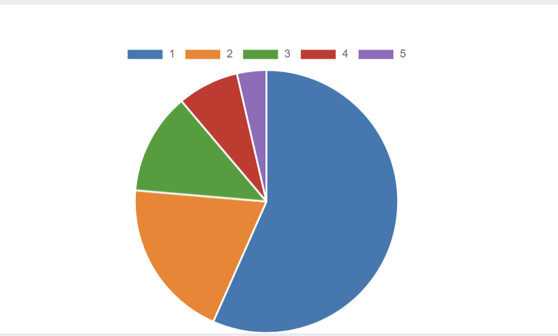
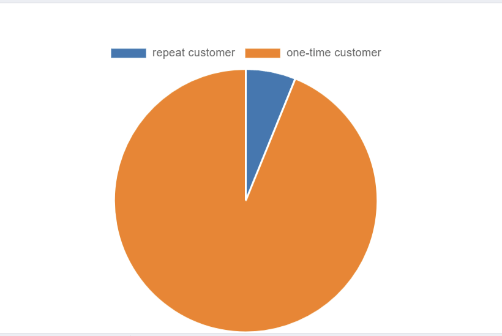
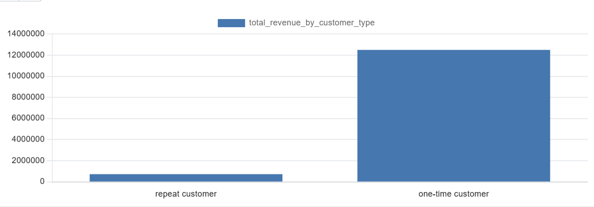

# Original research archive

[Reviewed project](../README.md) · [Corrections and validation](../docs/validation.md)

These 22 files are preserved byte-for-byte from the original project: five exploratory PostgreSQL SQL files, 15 sales, customer and delivery charts, a PNG ERD and its pgAdmin source. SHA-256 hashes are recorded in [manifest.json](manifest.json).

**Read the reviewed research pages for current findings.** The original monthly-revenue image displays order counts; the Customer-segment revenue-share chart uses an order-share calculation; the State delivery comparison stacks days and percentages; original review joins can weight orders more than once. These original artifacts document the research process and have not been silently rewritten.

## SQL and model

- [1. sales performance.sql](1.%20sales%20performance.sql)
- [2.customer behavior.sql](2.customer%20behavior.sql)
- [3.delivery & customer satisfaction.sql](3.delivery%20%26%20customer%20satisfaction.sql)
- [Check Data Quality.sql](Check%20Data%20Quality.sql)
- [Create database and constraints.sql](Create%20database%20and%20constraints.sql)
- [ERD.png](ERD.png)
- [olist_erd.pgerd](olist_erd.pgerd)

## Original sales figures

### monthly _order_amount_change

### monthly_revenue_change

### monthly_revenue_growth(17.01-18.08)

### revenue_share_by_state

### top 10 revenue share by category

## Original customer figures

### amount_share_by_customer_type

### average-revenue_by customer_type

### repurchase interval share

### revenue_contribution_by_customer_class5

### revenue_share_by_customer_type

### total_revenue_by_customer_type

## Original delivery figures

### share between delay and punctual order

### share_of_delay vs average_review_score

### top10 delay delivery state

### trend of average delivery time vs delay rate percent

