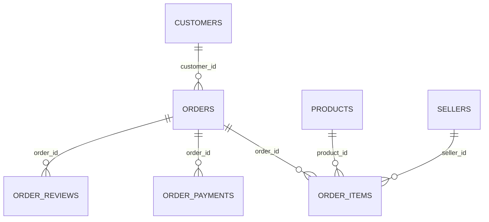
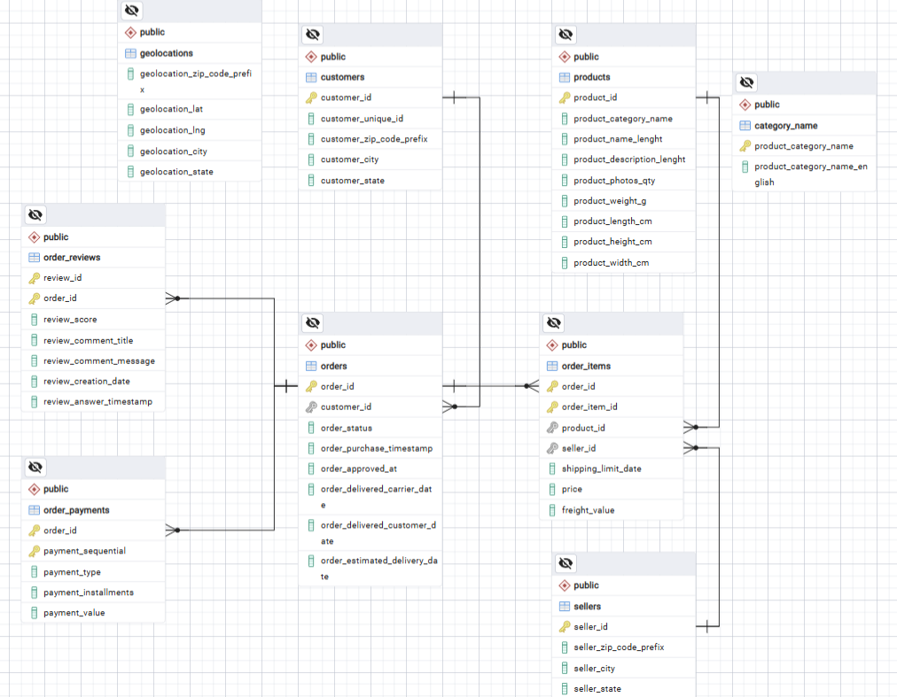

# Data model

[Overview](../README.md) · [Reviewed model SQL](../sql/00_model.sql)

| Source table | Grain | Join / key notes |
| --- | --- | --- |
| customers | Order-specific customer record | `customer_id` is unique; `customer_unique_id` links purchases by the same person. |
| orders | Order | `order_id` is unique; joins to the order-specific customer record. |
| order_items | Item within order | Composite key `(order_id, order_item_id)`; multiple items per order. |
| order_payments | Payment sequence within order | Composite key `(order_id, payment_sequential)`; profiled, not used for merchandise sales. |
| order_reviews | Review/order pair | `(order_id, review_id)` is unique in this snapshot; an order can have several reviews. |
| products | Product | Joins category translation on Portuguese category label. |
| sellers | Seller | `seller_id` is unique. |
| category_name | Category translation | Two source category labels have no matching translation; missing/untranslated products are retained. |
| geolocations | Postal-coordinate observation | Postal prefix is nonunique; not joined to the analytical model. |

The [PostgreSQL schema](../sql/setup/01_schema.sql) preserves IDs and postal prefixes as text, uses `NUMERIC(15,2)` for money and `TIMESTAMP` for source timestamps, and enforces primary keys, composite keys, foreign keys and selected numeric constraints. Run it in a new project database. The [SQL quality checks](../sql/setup/03_quality.sql) then profile source issues before the analytical views are created.

[Original pgAdmin ERD source](../archive/olist_erd.pgerd). The diagram documents the original research model; the reviewed model adds aggregated analytical views.
