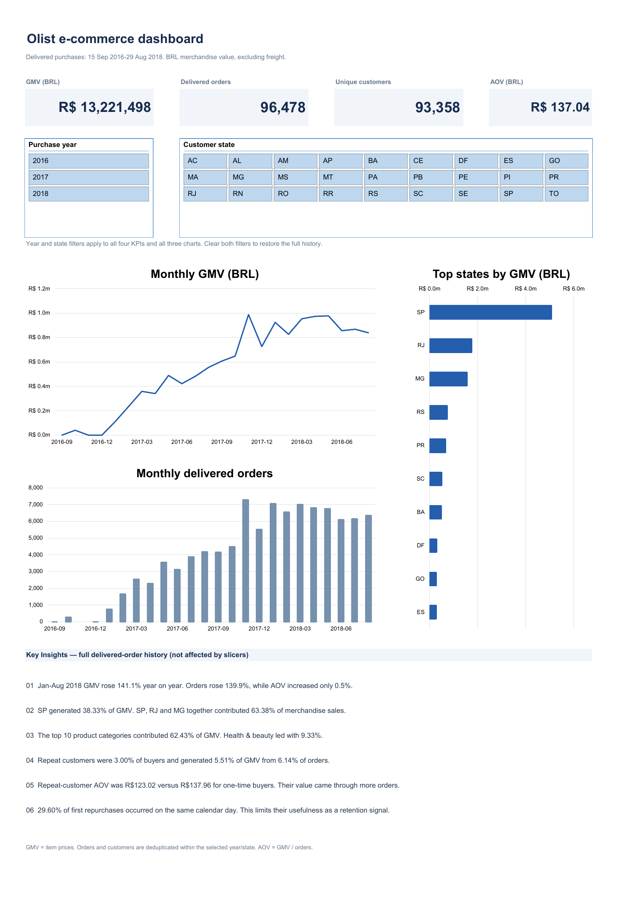

# Olist Excel analysis

[Project overview](../README.md) · [SQL methodology](../docs/methodology.md) · [Excel validation](validation.md) · [Research preservation map](preservation-map.md)

An interactive Excel supplement to the PostgreSQL project, built from the same historical Olist data. Purchase-year and customer-state slicers connect four KPI cards to monthly GMV, monthly orders and top-state charts.

[Download the workbook](Olist_Excel_Analysis.xlsx)

## Use the workbook

Open the downloaded `.xlsx` in desktop Microsoft Excel. The saved workbook includes its data snapshot and can be explored without connecting to PostgreSQL or downloading CSVs separately.

1. Start on `dashboard`. Select a purchase year, a customer state, or both.
2. Read merchandise GMV, delivered orders, distinct purchasing customers and average order value together with the three charts. All use the same selected orders.
3. Use each slicer's clear button to return to the full delivered-order history.
4. Open `analysis` for the original research: monthly and indexed growth, category concentration and pricing, customer contribution, Welch t-test, repeat-order frequency, first-repeat timing and state comparisons. These tables and charts do not respond to dashboard slicers.

All 12 native PivotTables are on `pivot diagram`. Eight support the full-history analysis; four support the dashboard. Both slicers connect to all four dashboard pivots, including the distinct-customer pivot. There are 11 native analysis charts and three live dashboard charts. The original 12 source and working tables and 12 Power Query definitions are preserved. The dashboard's order data comes from the existing `fact_orders` query table, with an added `purchase_year` formula column.

## Original research preserved

The original workbook's 33 chart objects repeated 13 distinct subjects across worksheets. All 13 subjects are retained in 14 editable charts, with duplicate copies consolidated and formatting standardised. The [preservation map](preservation-map.md) records the original and current locations of every subject and supporting analytical block.

The customer analysis retains the original **customer-level Welch t-test**: t = −5.5959974343, with a two-sided Excel p-value of approximately 2.38 × 10⁻⁸. Each customer contributes one average order value to this test. The repeat-customer mean is R$122.96; segment order-weighted AOV remains a separate R$123.02 measure. See the [test definitions and interpretation](customer-welch-note.md).

Other native Excel previews: [indexed and monthly growth](analysis-growth.png) · [category ranking and Pareto analysis](analysis-pareto.png) · [category pricing and repeat timing](analysis-scatter.png).

The exact repeat-order distribution is retained: 2/3/4/5/6/7/9/15 orders correspond to 2,573/181/28/9/5/3/1/1 customers. Category analysis retains all 72 categories, average item price and the cumulative GMV curve: the first 18 categories cross 80% of GMV.

## Metric definitions

| Measure | Definition |
| --- | --- |
| Merchandise GMV | Sum of `order_items.price` for orders recorded as delivered. BRL; excludes freight, payment amounts, fees and refunds. |
| Delivered orders | Distinct `order_id` after the year and state selections. |
| Purchasing customers | Distinct `customer_unique_id` in the selected orders. A person appearing in several months is counted once in the KPI. |
| Average order value | Selected merchandise GMV divided by selected delivered orders. |
| Year / month | Purchase timestamp, without timezone conversion. |
| Customer state | Customer address state, not seller origin. |

The Power Query order table aggregates item values to one row per delivered order before the dashboard pivots. The customer KPI counts distinct person labels under the active filters; it does not add monthly or state customer counts. The identifier `customer_id` belongs to an order-specific customer record and is not the person identifier.

With both filters cleared, the controls are **R$13,221,498.11 GMV**, **96,478 delivered orders**, **93,358 purchasing customers** and **R$137.04 AOV**. Delivered purchases span **15 September 2016–29 August 2018**.

Excel's monthly levels and full-history analyses cover September 2016–August 2018. The original indexed comparison intentionally covers January 2017–August 2018, with January 2017 = 100 for GMV, orders and AOV. The SQL and Power BI monthly series uses that same January 2017–August 2018 window and totals R$13,181,027.13 across 96,211 orders. The full-history difference is 267 delivered orders worth R$40,470.98 purchased in 2016; the two scopes reconcile. November 2016 is retained as a zero-order month, with unavailable AOV shown as a gap.

## Six findings

- **January–August 2018 GMV rose 141.1% year on year.** Orders rose 139.9%, while AOV increased 0.5%, so the observed growth mainly came from order volume. The comparison uses the same eight purchase months in each year.
- **SP generated 38.33% of GMV.** SP, RJ and MG together contributed 63.38% of merchandise sales, showing substantial concentration in three customer markets.
- **The top 10 product categories contributed 62.43% of GMV.** Health and beauty led with 9.33%. Shares use all delivered merchandise value, including products without a translated category; the displayed top 10 are a subset.
- **Repeat customers were 3.00% of buyers.** They generated 5.51% of GMV from 6.14% of orders. Order share and GMV share are separate measures.
- **Repeat-customer AOV was R$123.02, versus R$137.96 for one-time buyers.** Their higher observed spend per customer came through more orders. Segment AOV divides segment GMV by segment orders; it is not the unweighted mean of individual customer AOVs.
- **29.60% of first repurchases occurred on the same calendar day.** These 829 customers limit how confidently an observed second order can be interpreted as a later retention event.

Repeat means at least two delivered orders within the extract. First-repeat intervals use calendar-date differences, not elapsed 24-hour periods. The six interval groups contain **829** same-day customers, **199** at 1–7 days, **388** at 8–30 days, **492** at 31–90 days, **811** at 91–365 days and **82** after 365 days; together they reconcile to 2,801 repeat customers.

These figures are not a cohort retention rate: follow-up differs across customers, and recent customers have less time to return. All findings describe historical records, not current Olist performance, causal effects or profit. The final purchase periods may have incomplete follow-up of delivery outcomes.

## Refresh the source data

Exploring the saved snapshot does not require a refresh. To replace or refresh its CSV sources:

1. Put the six required source CSVs in a local folder: orders, order items, payments, products, category translation and customers. Keep their original filenames and column structures.
2. In **Data → Queries & Connections**, edit each of the six source queries and update its **Source** file path. The saved paths are absolute paths to the author's `Desktop/Olist ECOMMERCE/data_excel` folder. The six derived queries use those source queries.
3. Choose **Data → Refresh All**, then wait until the source and dependent Power Query queries finish loading. Check Queries & Connections for errors before continuing.
4. After the queries finish, explicitly refresh the PivotTables on `pivot diagram`. PivotTables can otherwise retain a cache from before the query refresh completed.
5. Check that the `purchase_year` calculated column in `fact_orders` has extended to every loaded order row; this table formula is designed to fill into new rows automatically. Recalculate the workbook and clear both dashboard slicers.
6. Reconcile the KPI totals, category and customer totals, interval counts and charts against the refreshed data. Review the written findings manually if the dataset changed, then save the workbook.

The saved snapshot, native pivot refresh and Excel recalculation were verified. A runtime **Refresh All** of the external CSV queries was not tested in this refinement. The figures above are controls for the supplied snapshot, not expected totals for a different dataset.

## Validation and source

The source preservation comparison checked **7,693,932 nonempty cells** across the original 12 source and working tables and found **zero mismatches** in the original table ranges. Separately, **32 workbook checks**, **six native slicer scenarios** and **130 independent saved-file checks** passed, including research coverage, restored calculations, chart series and shifted references. The dashboard and four analysis previews were visually inspected. See [Excel validation](validation.md) for the verification scope.

Data: [Brazilian E-Commerce Public Dataset by Olist](https://www.kaggle.com/datasets/olistbr/brazilian-ecommerce), published by Olist on Kaggle and described by the publisher as anonymised commercial data. This workbook embeds the source worksheets and derived working tables supplied with the original Excel analysis. Raw CSVs are not committed separately. Consult the publisher's page for the dataset's terms; this project does not replace or alter them.

All nine supplied CSVs match the SHA-256 checksums in the project's [validated source manifest](../reports/results/metrics.json). Original analysis: [autunno816-ux](https://github.com/autunno816-ux). Workbook refinement and validation were prepared with AI assistance. This is an independent portfolio project.
