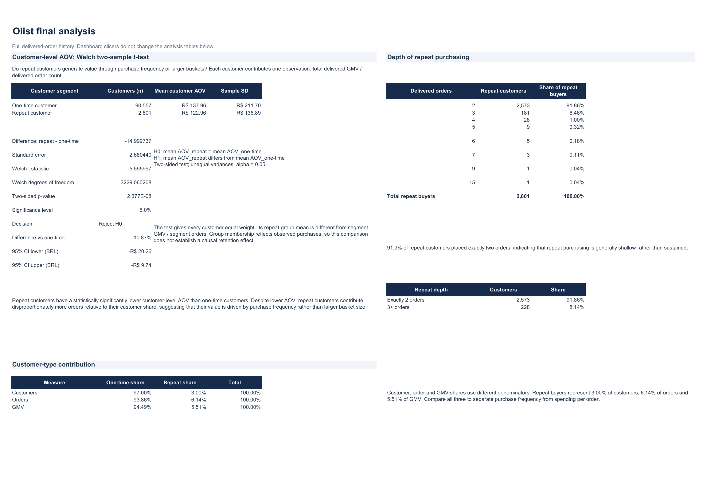

# Customer-level AOV comparison

[Excel guide](README.md) · [Validation](validation.md) · [Preservation map](preservation-map.md)

The original research asks whether repeat customers generate value through purchase frequency or higher spending per order. The workbook retains both the customer-level comparison and the order-weighted business metric, with distinct labels.



## Two useful AOV measures

| Measure | Calculation | Unit receiving equal weight | One-time customers | Repeat customers |
| --- | --- | --- | ---: | ---: |
| Mean customer-level AOV | For each person, merchandise GMV / delivered orders; then mean across people | Customer | R$137.95829544 | R$122.95855832 |
| Segment order-weighted AOV | Segment merchandise GMV / segment delivered orders | Order | R$137.95829544 | R$123.02123797 |

The one-time values coincide because each person has one order. Repeat customers have different order counts, so the two repeat means differ. The Welch test uses **customer-level AOV observations**; replacing its repeat mean with R$123.02123797 would change the quantity being tested and would not match the customer-level sample SD or sample size.

## Original Welch unequal-variance, two-sided t-test

| Input | One-time | Repeat |
| --- | ---: | ---: |
| Customer count, n | 90,557 | 2,801 |
| Mean customer-level AOV, BRL | 137.9582954383 | 122.9585583238 |
| Sample SD of customer-level AOV, BRL | 211.7013125776 | 136.8878164627 |

Null hypothesis: the two population means of customer-level AOV are equal. Alternative: they differ. Define the difference as **repeat minus one-time**.

```text
Difference = mean_repeat − mean_one_time
SE = SQRT(sd_repeat^2 / n_repeat + sd_one_time^2 / n_one_time)
t = Difference / SE
df = (sd_repeat^2/n_repeat + sd_one_time^2/n_one_time)^2
     / ((sd_repeat^2/n_repeat)^2/(n_repeat−1)
        + (sd_one_time^2/n_one_time)^2/(n_one_time−1))
Two-sided p = T.DIST.2T(ABS(t), df)
```

| Original result | Value |
| --- | ---: |
| Difference in means | −R$14.99973711 |
| Standard error | R$2.6804403130 |
| t statistic | −5.5959974343 |
| Welch degrees of freedom | 3,229.060207778 |
| Original Excel two-sided p-value | approximately 2.3767438687 × 10⁻⁸ |
| Decision at 5% | Reject equal means under the test assumptions |

The restored formulas were recalculated in native Excel using full-precision inputs. The verified result is t = −5.595997434259582, df = 3,229.060207778023 and p = 2.3767438686897664 × 10⁻⁸. The p-value is displayed in scientific notation.

An independent CSV/SciPy calculation gives p = 2.376740337558702 × 10⁻⁸ with the full fractional df, and 2.3767438692743723 × 10⁻⁸ using integer df. The latter agrees with Excel to numerical precision: the small difference comes from Excel's integer degrees-of-freedom treatment, without changing the conclusion.

**In this extract, repeat customers have a lower mean customer-level AOV by about R$15. The Welch test finds evidence of a mean difference under its assumptions. Repeat customers' larger observed spend per person is associated with placing more orders.**

The test treats customers as independent units and permits unequal group variances. The groups are defined by observed purchase histories, with unequal follow-up and a skewed spending distribution. This comparison does not show that becoming a repeat customer causes lower AOV or that a retention programme would change spending. The p-value addresses a difference in means under the model; it does not measure the business value of an intervention.

Original evidence: `analysis!AM1:AP19`, with mean/SD/customer-count inputs also in `customer_order_behaviour!H17:K20`. Verified restored evidence: `analysis!B140:G165`, with inputs in `B143:E145`, t in `C150`, df in `C151`, p in `C152` and decision in `C154`. These values passed both native Excel checks and independent saved-workbook inspection.
