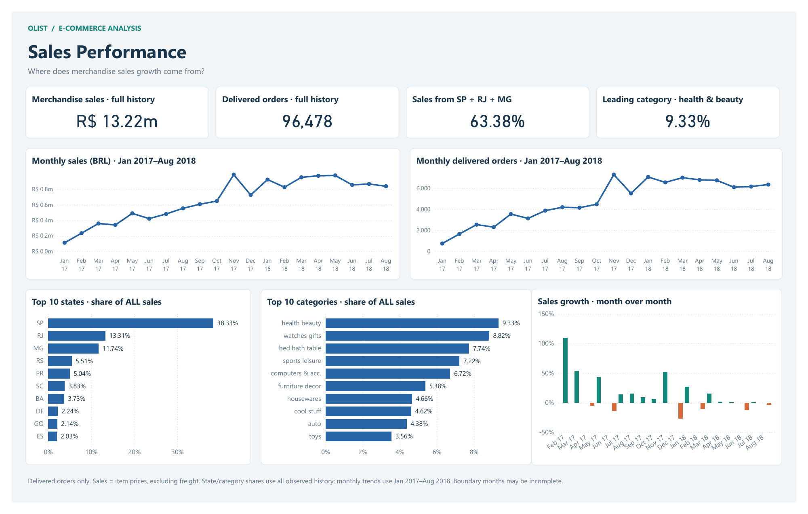
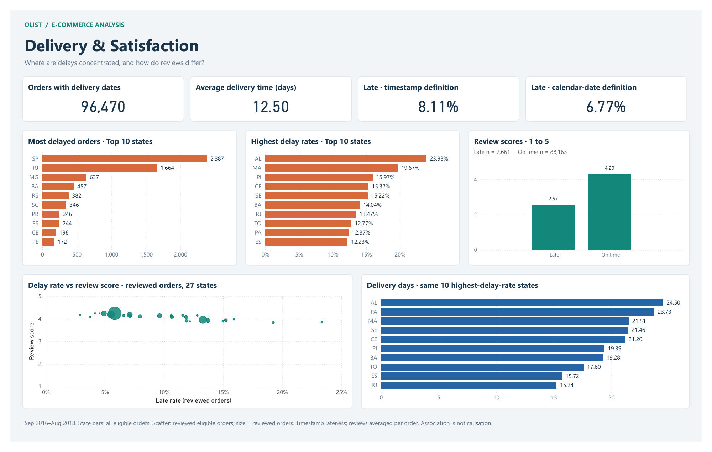

# Olist — Power BI report

[Open the PBIX](Olist.pbix) · [View the PDF](Olist.pdf) · [SQL project](../README.md)

Three English report pages present the reviewed PostgreSQL results. The PBIX includes the aggregate snapshot, so it opens without database credentials, raw CSVs or Python. This is a historical portfolio report, not a live connection to Olist.

## Pages and chart intent

| Page | What each visual communicates |
| --- | --- |
| **Sales Performance** | Separate monthly sales and order trends; positive/negative month-over-month sales growth; state and category shares of **all** merchandise sales. |
| **Customer Behaviour** | Repeat customers' shares of people, orders and sales; observed spend per customer; spending-fifth concentration with a cumulative line; first-repeat timing among observed repeat customers. |
| **Delivery & Satisfaction** | Delivery eligibility, average days and both lateness definitions; state delay **counts** beside **rates**; late/on-time review means with sample sizes; state-level delay/review association; delivery days for the ten highest-delay-rate states. |





## Open and explore

Download [Olist.pbix](Olist.pbix) and open it in Power BI Desktop. Use the sales, customer and delivery tabs and hover over marks for values, sales amounts or order counts. Native sorting and focus mode remain available.

Cross-visual filtering is deliberately disabled. Monthly, state, category and customer-segment results have different grains and no shared detail model. A state selection therefore does not claim to filter customer cohorts or monthly sales. The published PDF and PNGs are static exports of these native Power BI visuals.

For the editable project, clone the repository and open [Olist.pbip](Olist.pbip). On a fresh clone, choose **Home → Refresh** to populate the model from its embedded aggregate snapshot. The local data cache is excluded from Git. If Desktop offers to upgrade the semantic model to TMDL, choose **Don't upgrade** to retain compatibility with the supplied snapshot updater.

## Source and metric contract

- PostgreSQL computes the analytical result tables in [reports/results](../reports/results). The model imports those ten reviewed aggregates and derives six small display tables for rankings and repeat contribution.
- DAX handles display measures, percentage scaling, English month labels and cumulative sums of already aggregated sales. SQL remains the source for order eligibility, identity, joins, segmentation and lateness.
- Merchandise sales are item prices in BRL, excluding freight. `m` means millions. Display rounding does not change the underlying SQL aggregates.
- Monthly charts cover Jan 2017–Aug 2018; other figures use observed delivered purchases from Sep 2016–Aug 2018. Boundary months can be incomplete.
- Repeat means at least two delivered orders per unique person in the extract. It is not cohort retention or lifetime value; same-day repeats are included.
- State delay bars use all delivery-eligible orders. The scatter uses reviewed eligible orders for **both** axes; bubble size is reviewed-order count. These are associations, not causal estimates.
- Review means give each reviewed order equal weight after averaging its reviews. Timestamp lateness is 8.11%; comparing calendar dates produces 6.77%.

See [methodology](../docs/methodology.md) for full definitions. State abbreviations identify customer destinations. The abbreviated chart label `computers & acc.` means `computers_accessories` in the source.

## Refresh after rerunning SQL

Close the project in Power BI, rerun the PostgreSQL analysis and export all ten result tables using [sql/export_results.psql](../sql/export_results.psql). From the repository root, run:

```powershell
.\powerbi\Update-Snapshot.ps1
.\powerbi\Update-Snapshot.ps1 -Check
```

Then open `powerbi/Olist.pbip`, select **Refresh**, inspect all three pages and save. Use **File → Save as → Power BI file (.pbix)** to replace the portable PBIX, and **File → Export → Export to PDF** to regenerate the static export. Regenerate the PNG previews from that exported PDF. Updating the source model does not automatically update the PBIX, PDF or previews.

The updater runs in Windows PowerShell or PowerShell 7. It reads only aggregated CSVs, validates required columns and numeric types, preserves calculated display columns, and records SHA-256 source hashes in [snapshot-manifest.json](snapshot-manifest.json). It never reads the raw customer/order dataset or database credentials. Its `-Check` mode verifies source freshness, not rendered-chart correctness.

## Files

| File | Purpose |
| --- | --- |
| `Olist.pbix` | Portable report with aggregate data, saved by Power BI Desktop |
| `Olist.pbip` + `Olist.Report/` | Editable native PBIR report definitions |
| `Olist.SemanticModel/model.bim` | Semantic model, M snapshot expressions and DAX measures |
| `Olist.pdf` | Three pages exported by Power BI Desktop |
| `previews/` | PNG renders of the native PDF for GitHub |
| `Update-Snapshot.ps1` | Refresh the embedded snapshot after SQL CSV export |
| `snapshot-manifest.json` | Source hashes and presentation-table recipes |

Validated with Power BI Desktop 2.157.1354.0 (August 2026). The repository includes [native validation notes](validation.md). Format references: [Power BI projects](https://learn.microsoft.com/en-us/power-bi/developer/projects/projects-overview), [PBIR report definitions](https://learn.microsoft.com/en-us/power-bi/developer/projects/projects-report), [semantic model files](https://learn.microsoft.com/en-us/power-bi/developer/projects/projects-dataset).
