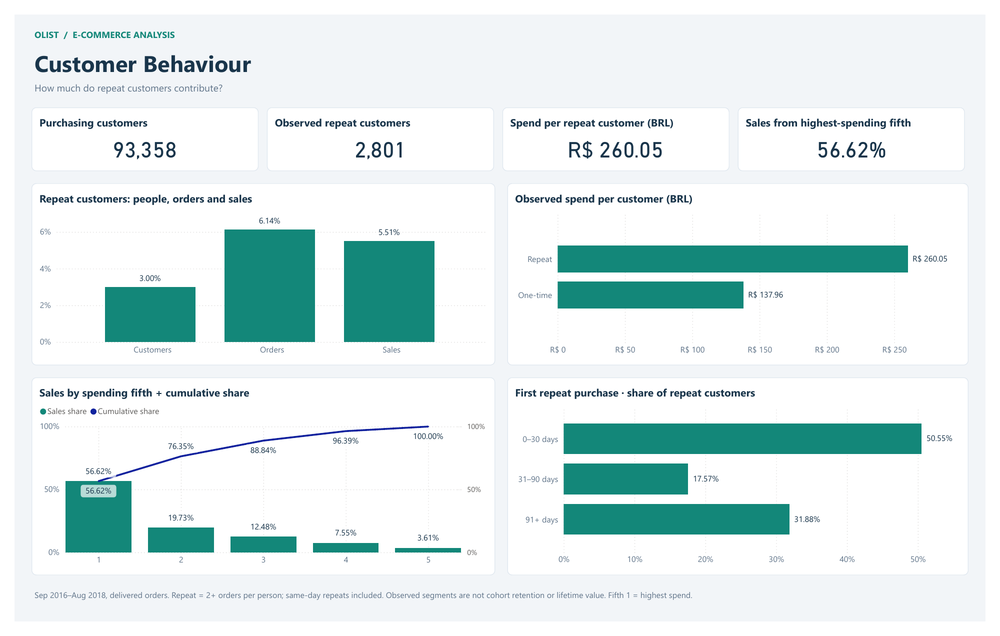

# Customer Behaviour

[Project overview](../README.md) · [SQL](../sql/02_customers.sql) · [Metric definitions](../docs/methodology.md)

[Open the interactive report or PDF](../powerbi/README.md).

There are 2,801 observed repeat customers out of 93,358 purchasing customers. They account for 3.00% of customers, 6.14% of delivered orders and 5.51% of merchandise sales. Their average observed merchandise spend is R$260.05 per customer, compared with R$137.96 for one-time customers.

## Customer mix and spend

| Customer type | Customers | Orders | Sales (BRL) | Sales share (%) |
|---|---|---|---|---|
| One-time | 90557 | 90557 | 12493089.36 | 94.49 |
| Repeat | 2801 | 5921 | 728408.75 | 5.51 |

Evidence: [customer segment results](results/q2_customer_segments.csv). A customer is identified by `customer_unique_id`, and repeat means at least two delivered orders in the extract. These groups are defined using their observed purchase outcomes; the comparison does not estimate the effect of a retention campaign.

## Concentration among high-spending customers

The highest-spending fifth contributes 56.62% of sales; the highest two fifths together contribute approximately 76.35%. `NTILE(5)` assigns customers to nearly equal-sized groups, ordered by observed sales with customer ID as a deterministic tie-breaker.

Evidence: [quintile results](results/q2_quintiles.csv). These are descriptive spending groups, not predicted lifetime-value segments.

## Time to the first observed repeat

Of repeat customers, 50.55% make their second delivered purchase within 0–30 calendar days, 17.57% within 31–90 days and 31.88% after 90 days.

Evidence: [interval results](results/q2_repurchase.csv). This distribution is conditional on an observed repeat. It includes same-day orders and excludes people who do not repeat during the extract. Customers acquired near the end have shorter follow-up, so it is not a survival curve or a cohort retention estimate.

## What to investigate next

A first-month retention experiment is a reasonable next study, with acquisition cohorts, equal observation windows and a holdout group. The results here do not demonstrate that a promotion would increase revenue, or that every one-time customer has churned.
